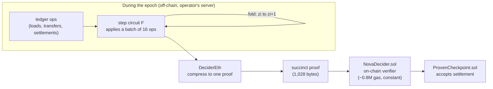
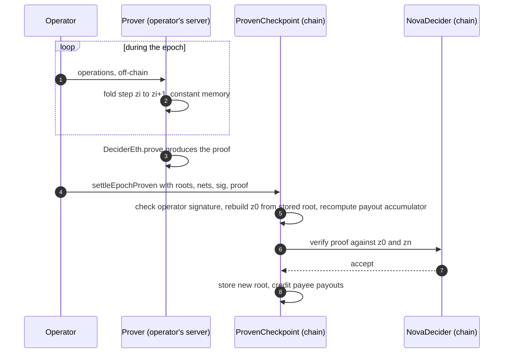
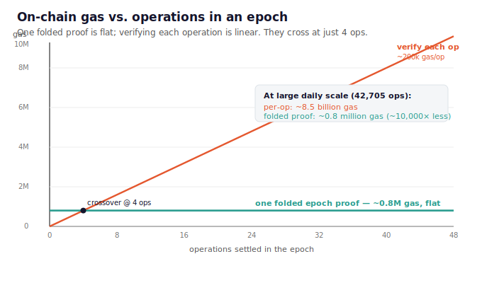
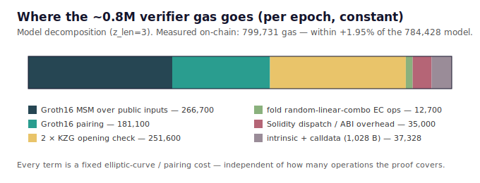
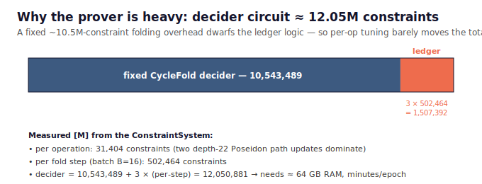

# Proving an off-chain balance ledger is correct — a technical report

*Audience: engineers with a solid technical background but no prior exposure to folding schemes
/ IVC or sonobe. This report explains what was built, what it costs, and why it matters. For the
security analysis see [TRUST_MODEL.md](TRUST_MODEL.md); for the code, the [README](../README.md).*

---

## What this is

An **operator** runs a ledger of account balances. Doing that on a public blockchain the naive
way costs one storage write per account per update — the dominant cost of on-chain payment
systems. The standard cheap alternative is to move the accounting **off-chain** and post only a
small **per-epoch checkpoint** on-chain: a commitment to the epoch's transfers plus one net
payout per payee. That's cheap and constant-cost — but the checkpoint is only *evidence*:
nothing on-chain forces the operator's posted numbers to be arithmetically correct.

This work adds a **validity proof** to that checkpoint. Once per epoch the operator submits a
single folded zero-knowledge proof, verified on-chain before settlement, that the epoch's entire
ledger transition was applied correctly. It costs a **flat ~0.8M gas regardless of how many
operations the epoch contained**.

> **Commit-only checkpoint** = cheap — but you trust the operator's books.
> **Checkpoint + validity proof** (this work) = the same cost, with the books cryptographically
> proven.

The rest of this report assumes no ZK background; §1 is the one-paragraph version, §2 the
primers, §3–4 what was built and measured, §5 why it matters.

---

## 1. The one-paragraph version

An operator keeps account balances in an off-chain Merkle-tree ledger and settles once per epoch.
Instead of trusting the operator's arithmetic, it **proves** it: a single folded (Nova+CycleFold)
zero-knowledge proof, verified on-chain, establishes that the whole epoch was applied correctly —
no balance went negative, nothing was double-applied, value was conserved, and the posted payee
payouts exactly match the proven operations. Verification is a **constant ~0.8M gas** no matter
how many operations the epoch covered (measured: 799,731 gas). At a large deployment's volume
that's about **18 gas per operation** — versus the ~200k gas/op it would cost to verify each
operation individually. It's a working prototype with real, measured numbers — not a paper
estimate.

---

## 2. Two primers (skip either you know)

### 2a. The off-chain ledger + checkpoint pattern
Keep per-account balances in a Merkleized tree off-chain. Spends become operator-signed
transfers, applied off-chain. Once per epoch, post two things on-chain: a commitment (Merkle
root) to the epoch's transfers, and the **net** amount owed to each payee. Constant on-chain cost,
no per-account write. The catch this work removes: the posted root is *evidence*, not
enforcement — if the operator posts numbers inconsistent with the transfers it signed, that's
detectable after the fact, but nothing on-chain *forces* correctness. A validity proof makes the
checkpoint self-enforcing.

### 2b. Folding / IVC, Nova+CycleFold, and sonobe — proving a huge computation cheaply
You cannot put "apply tens of thousands of ledger operations to a Merkle tree" into a single
zero-knowledge circuit — the prover would need impossible amounts of memory. **Incremental
Verifiable Computation (IVC)** via **folding schemes** solves this: define a tiny step circuit `F`
that applies one small batch of operations, then run it repeatedly, `z_{i+1} = F(z_i, wᵢ)`,
carrying a small state `z`. A folding scheme (**Nova**, with the **CycleFold** compiler) lets the
prover *accumulate* each step into a running claim using just a few elliptic-curve operations —
**constant memory per step** — instead of proving a full SNARK each time. At the end, one
**decider** proof compresses the whole accumulated computation into a single succinct proof.

**sonobe** is the Rust library (from PSE / 0xPARC) that implements exactly this — Nova+CycleFold
over the BN254/Grumpkin curve cycle — and, critically, can emit a **Solidity verifier contract**
(`NovaDecider`) whose gas cost is **fixed and independent of the number of steps folded**. That
fixed cost is the entire economic argument: fold a million operations, verify one small proof.

---

## 3. What was built

A self-contained prototype, in three layers, plus a measurement harness:

| Layer | What it is | Key file |
|---|---|---|
| **The step circuit `F`** | An arkworks circuit that applies a batch of 16 ledger operations to a depth-22 Poseidon Merkle tree, enforcing per operation: **inclusion**, **solvency** (96-bit balances, no negatives), **replay protection** (per-account nonces), **conservation** (debits = credits), and **accumulation** of the running state. | `crates/ledger-circuit` |
| **The prover** | Streams a synthetic epoch through Nova+CycleFold, produces the DeciderEth proof, and *generates the Solidity verifier* + calldata. | `crates/prover` |
| **The contract** | `ProvenCheckpoint` re-derives the proof's public inputs from its own stored state (so history can't be forged), recomputes the payee-payout accumulator on-chain with a Poseidon that is **bit-identical** to the circuit's, requires the generated verifier to accept the proof, and only then credits payouts. Includes a prover-outage degradation path and timelocked verifier upgrades. | `contracts/ProvenCheckpoint.sol` |
| **The harness** | Folds an epoch end-to-end and records prover time, memory, verifier gas, and calldata; a Python script compares the measured numbers to an analytical cost model. | `bench/`, `script/` |

The IVC state is just three field elements — `z = [stateRoot, opsAcc, netsAcc]` — the Merkle root
of all balances, an accumulator over every operation, and an accumulator over the payee payouts.
The on-chain verifier is handed the *before* and *after* of this tiny state and the proof; that's
all it needs.

### The epoch, end to end

---

## 4. Results (all measured `[M]` on a real toolchain, not estimated)

### 4a. The headline: cost is flat in the number of operations
Verifying each operation on-chain costs ~200k gas *per operation* and scales linearly. One folded
epoch proof is a **fixed ~0.8M gas** no matter how many operations it covers. They break even at
just **4 operations**; beyond that, folding wins, and the gap explodes with scale.

At a large deployment's volume (**~42,705 operations/day**), per-operation verification would cost
~8.5 **billion** gas; the folded proof costs ~0.8 **million** — roughly **10,000× less**, i.e.
**~18 gas per operation**.

### 4b. What the ~0.8M verifier gas is made of
The measured on-chain verification is **799,731 gas** — within **+1.95%** of an analytical model
(built by counting the generated verifier's elliptic-curve operations at Prague prices;
784,428 gas). This prototype confirms that model against a *real* generated verifier and a *real*
proof. Every component is a fixed elliptic-curve or pairing cost:

Other measured on-chain figures: one-time verifier **deployment** 3.22M gas; full
`settleEpochProven` transaction (proof verify + on-chain payout-accumulator recompute + storage +
credits) 3.61M gas; **calldata** 1,028 bytes.

### 4c. The real cost is the prover, and it's dominated by a fixed overhead
The step circuit measures **31,404 constraints per operation** (two depth-22 Poseidon Merkle path
updates dominate) → **502,464 per fold step** (batch of 16). The final decider circuit is
**~12.05M constraints** — but ~10.5M of that is **fixed folding overhead** that exists no matter
how simple the step is:

Two consequences: (1) the prover is genuinely heavy — the decider needs ≈ **64 GB RAM** and
minutes per epoch (a server job, run once per epoch, off the critical path since folding streams
*during* the epoch); (2) optimizing the ledger logic barely moves the total, so the on-chain gas —
the number that actually matters for the economics — is robust.

*(Prover time/RAM here were measured with sonobe's `light-test` mode, which shrinks the decider so
the pipeline runs on a 24 GB laptop. The **verifier gas is unaffected** by this — it depends only
on the proof's public-input layout, not the circuit's internals — so 4a/4b are production-
representative; the absolute prover time/RAM are not, and are flagged as the one number still to
be pinned on 64 GB hardware.)*

### 4d. A subtle but load-bearing result: the on-chain hash matches the circuit
The payee-payout accumulator is computed *inside* the proof (in the circuit) and *again* on
Ethereum (in Solidity), and the contract requires them to be equal. For that check to be
meaningful, the two Poseidon hashes must be **byte-identical**. The prototype generates the
Solidity Poseidon from arkworks' *own* constants and pins the match with a cross-check fixture —
and the on-chain test confirms it. This is the kind of detail that silently breaks real
deployments; here it's demonstrated green.

### 4e. Estimated cost at different scales
The key economic property: **the proof-verification bill depends only on how often you settle
(epochs/month), not on how many operations happened** — the verifier cost is constant per epoch.
Using the measured 799,731 gas/epoch and the dollar recipe
(`$ = gas × gas_price_gwei × 1e-9 × 1680`, ETH = $1,680):

| Settlement cadence | Proof gas / month | @ 0.8 gwei | @ 5 gwei | @ 30 gwei |
| --- | ---: | ---: | ---: | ---: |
| Weekly (4 epochs) | 3,198,924 | **$4.30** | $26.87 | $161.23 |
| Daily (30 epochs) | 23,991,930 | **$32.25** | $201.53 | $1,209.19 |

Those dollar figures are the **same for a tiny deployment and a national-scale one** — only the
*per-operation* amortization changes with volume:

| Deployment | Payees | Operations / month | Cadence | Amortized proof cost | If you instead verified each op (~200k gas/op) |
| --- | ---: | ---: | --- | ---: | ---: |
| Small | 4 | ~97,600 | daily | **~246 gas/op** | ~19.5 **billion** gas/month |
| Small | 4 | ~97,600 | weekly | ~33 gas/op | ~19.5 billion gas/month |
| Large | 42 | ~1,281,000 | daily | **~18.7 gas/op** | ~256 **billion** gas/month |
| Large | 42 | ~1,281,000 | weekly | ~2.5 gas/op | ~256 billion gas/month |

At large-daily scale the folded proof costs ~24M gas/month versus ~256 **billion** for
per-operation verification — a ~10,000× reduction, i.e. fractions of a cent per operation.

**The honest caveat — one cost *does* grow with scale.** Beyond the constant proof, each epoch's
settlement also recomputes the payee-payout accumulator on-chain, one Poseidon hash per payee. In
this prototype that hash is a naive pure-Solidity implementation measured at **855,623 gas each**,
so the payee-linear part dominates at scale:

| | verify (constant) | + nets recompute (per-payee × 0.86M) | ≈ total settle / epoch |
| --- | ---: | ---: | ---: |
| Small (4 payees) | 0.80M | ~3.4M | **~4.2M gas** |
| Large (42 payees) | 0.80M | ~35.9M | **~36.7M gas** |

This is an *implementation* artifact, not fundamental (the generated Poseidon rebuilds its
340-constant tables every call). Production fixes: a Poseidon precompile (~20k/hash → the whole
nets recompute drops ~40×) or per-payee claims against a proven `netsRoot` (making the settle path
O(1) in payees), which bring total per-epoch cost back toward the ~1M-gas range even at large payee
counts. **The headline ~0.8M constant verifier cost is real and robust; the payee-linear term is
the piece flagged for optimization before scaling the payee set.**

---

## 5. Why this matters

- **It converts trust into proof, cheaply.** A commit-only checkpoint gives low, constant on-chain
  cost but requires trusting the operator's off-chain arithmetic. This keeps the low cost and
  *removes* that trust — every epoch is provably correct, publicly, forever — for a constant ~0.8M
  gas. A heavyweight alternative (a bonded fraud-proof challenge game with watchtowers and delayed
  finality) becomes unnecessary rather than merely deferred, and finality is immediate at
  settlement.
- **The economics are decisive and future-proof.** ~18 gas/op at large scale is a small fraction
  of a cent per operation. Because the cost is compute (pairings/MSM), not storage, it is largely
  insulated from the gas-repricing directions Ethereum is heading.
- **It's a minimal slice of a rollup, not a rollup.** You get a private engine with a public,
  *proven* anchor — without running a sequencer, a data-availability pipeline, or upgrade
  governance for a whole chain. The party already trusted to operate the ledger simply proves its
  books.
- **It's measured, not projected.** The contribution is de-risking: taking an analytical verifier
  cost model and confirming it as measured `[M]` against real sonobe code, a real generated
  verifier, and a real proof — including the awkward integration details (Poseidon match, calldata
  layout, EVM verification) that estimates gloss over.

### Composing with one-time / unlinkable recipient addresses
The circuit keys leaves by `keccak256(address ‖ tokenId)`, so it is **agnostic to how an address
was derived** — an ordinary account and a fresh, one-time, unlinkable address (e.g. an
[ERC-5564](https://eips.ethereum.org/EIPS/eip-5564) stealth address) are both just inputs to that
hash. Two implications:

- **They compose cleanly.** Unlinkable addresses provide recipient (*who*) privacy off-chain; the
  proof independently keeps every account identity, balance, and amount in the prover's witness
  (never on-chain) and publishes only roots, accumulators, and per-payee settlement amounts. The
  proof adds **no** linkage — the public accumulators are Poseidon hashes of high-entropy keys —
  and the one metadata leak (op count via `i`) is independent of it and closed by constant-`i`
  padding. (Amounts still aren't confidential; that needs a shielded pool.)
- **They make lazy account insertion mandatory.** One-time addresses are fresh per payment, so the
  ledger sees a continuous stream of new keys rather than a fixed account set. The prototype
  *pre-registers* accounts; a real deployment must insert new leaves on the fly (prove the slot is
  empty, then insert) — the key-indexed *indexed Merkle tree* of production requirement #1 — and
  must size or rotate the depth-22 (~4.2M-leaf) tree for one-time-address churn. This is an
  account-lifecycle concern, **not** a change to the proving pipeline: correctness, verifier gas,
  calldata, and the trust model are unaffected.

### Honest scope
This is a **prototype**, and its usefulness is **specific**: it strengthens the *integrity* of an
operator-run off-chain balance ledger. It does **not** make amounts confidential (payee payouts
remain visible on-chain, as in any netting checkpoint). On custody, an **escape hatch** (`exit`)
is now implemented — a user can always withdraw their proven balance with their own key, so funds
**can't be trapped**; but the operator can still move a balance in a valid transition *before* you
exit until in-circuit user-signed debits land (deferred — see
[DECENTRALIZATION.md](DECENTRALIZATION.md)). So today's boundary **on this (`main`) line** is
**non-custodial funds with an operator trusted only for liveness**, not full non-custody.

> **Update:** full non-custody is now **implemented on the `newline-port` branch** — the operator can
> neither forge/duplicate an account (**A0**, indexed interval tree, closing the key-to-tree-position
> gap noted below) nor move a balance without the account's spend key (**A1**, per-debit in-circuit
> Schnorr). It folds through a LegoGroth16 decider measured at ≈696k on-chain gas. See
> [BUILD_PLAN_A0_A1.md](BUILD_PLAN_A0_A1.md) + [DECIDER_RESULTS.md](DECIDER_RESULTS.md). It is still
> dev-setup and pinned to an unmerged sonobe PR (ceremony/audit: [CEREMONY_AND_AUDIT.md](CEREMONY_AND_AUDIT.md)).

Before production this line needs, at minimum: a real
key-to-tree-position binding (the current tree doesn't enforce it), a real trusted-setup ceremony
(this uses a dev-mode setup), security audits, and the prover numbers re-measured on 64 GB
hardware. These are enumerated in [TRUST_MODEL.md §6](TRUST_MODEL.md).

---

## 6. Where to look next

- **Run it:** [README §Quick start](../README.md#quick-start) — circuit tests + measured
  constraints in ~1 min; the full fold→prove→on-chain-verify path on modest hardware via
  `light-test`.
- **Where it fits (and where it doesn't):** [USE_CASES.md](USE_CASES.md).
- **Sovereignty & exit roadmap:** [DECENTRALIZATION.md](DECENTRALIZATION.md).
- **Trust & privacy:** [TRUST_MODEL.md](TRUST_MODEL.md).
- **Reproduce the numbers here:** `results/comparison.md` (measured vs model),
  `results/measured.json`.

> **Prototype — not production. Not audited. Uses a dev-mode trusted setup.**
